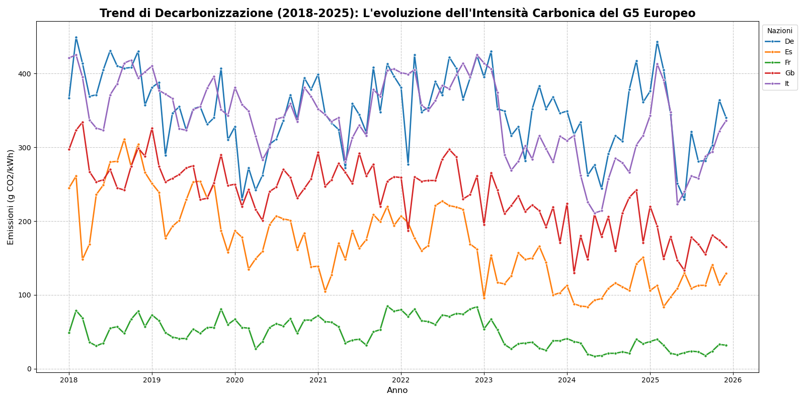
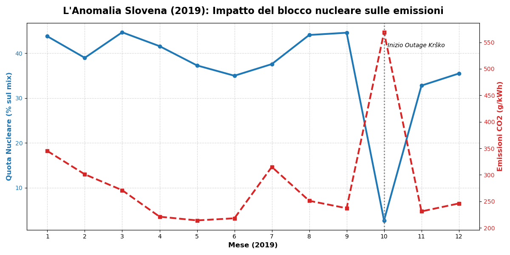
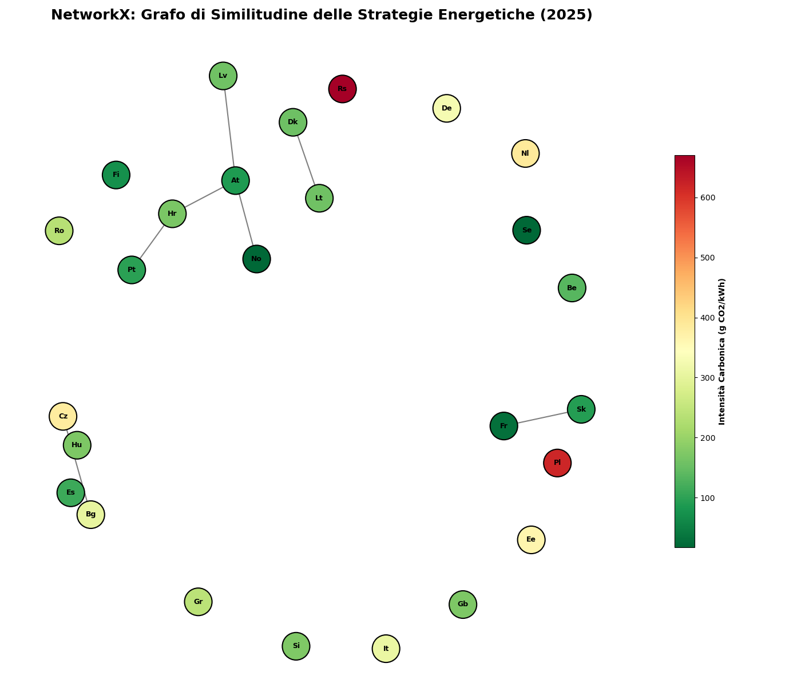

# European Energy Mix & CO2 Tracker: A Web Scraping ETL Pipeline

Pipeline end-to-end di raccolta, pulizia e analisi del mix energetico europeo — dallo scraping di un sito dinamico senza API pubbliche fino alla network analysis su similarità tra paesi.

**Competenze dimostrate**: scraping su sito dinamico (Selenium + endpoint AJAX), pipeline ETL completa con validazione dei dati, analisi statistica con attenzione ai limiti metodologici, network analysis applicata a un caso reale.

## Descrizione

Progetto di raccolta e analisi del mix energetico europeo tramite web scraping del sito [Nowtricity](https://nowtricity.com). Il dataset copre 26 paesi europei dal 2018 al 2025 (2.220 osservazioni) e include emissioni di CO₂, percentuale di rinnovabili e composizione dettagliata per fonte energetica.

Nato come progetto per il corso di Laboratorio di Web Scraping (UNIPI), con traccia proposta autonomamente in alternativa a quella standard del corso.

## Findings principali

- **L'anomalia slovena (2019)**: lo spegnimento programmato della centrale nucleare di Krško nell'ottobre 2019 mostra un effetto immediato e misurabile — le emissioni sono raddoppiate nello stesso mese, con il deficit energetico coperto dal carbone e non dalle rinnovabili.
- **Rinnovabili ≠ decarbonizzato**: la Francia dimostra che basse emissioni non richiedono necessariamente alte quote di rinnovabili — il nucleare ottiene lo stesso risultato per una via diversa.
- **Correlazione rinnovabili/emissioni**: r = -0.570 su dati mensili pooled, r = -0.522 sulle medie per paese — la differenza riflette la componente stagionale mescolata nei dati pooled rispetto alla sola componente strutturale tra paesi.
- **Cluster energetici europei**: un grafo di similarità costruito con NetworkX (soglia di correlazione 0.90 sul mix di 6 fonti energetiche) mostra pochi gruppi di paesi con strategie energetiche simili — Polonia e Serbia risultano isolate e tra le più carboniche in tutti gli anni analizzati (2018, 2021, 2025).

## Alcuni grafici







## Struttura del progetto

```
european-energy-scraper/
├── data/
│   ├── raw/          # JSON grezzi per paese (output dello scraper)
│   └── processed/    # Dataset puliti per paese e master dataset
├── notebooks/
│   ├── 0.Exploration.ipynb    # Ispezione del sito e sviluppo dello scraper
│   ├── scrape_total.ipynb     # Scraping completo dei 26 paesi
│   └── Data_Cleaning.ipynb    # Pulizia, validazione e costruzione dataset
└── outputs/
    ├── Analisi.ipynb          # Analisi complete e visualizzazioni
    ├── Analisi.pdf            # Versione PDF del notebook finale
    └── figures/               # Grafici esportati
```

## Come riprodurre i risultati

### 1. Installa le dipendenze

```bash
pip install -r requirements.txt
```

### 2. Esegui i notebook in ordine

```
0.Exploration.ipynb    → ispezione del sito
scrape_total.ipynb     → raccolta dati (richiede ~150 minuti)
Data_Cleaning.ipynb    → pulizia e validazione
Analisi.ipynb          → analisi e visualizzazioni
```

> Il dataset processato è già incluso in `data/processed/` — puoi eseguire direttamente `Analisi.ipynb` senza riscrapare.

## Dataset

- **Fonte**: [Nowtricity](https://nowtricity.com) (dati ENTSO-E)
- **Copertura**: 26 paesi europei, gennaio 2018 — dicembre 2025
- **Righe**: 2.220 osservazioni
- **Colonne principali**: `country_name` (contiene codici ISO a 2 lettere, non nomi paese — eredità della pipeline), `month_id`, `co2_g_kwh`, `renewable_perc`, `total_twh`, colonne per fonte energetica (`source_*_perc`)

## Analisi prodotte

1. Trend storico CO₂ per le 5 principali potenze europee (2018–2025)
2. Ranking europeo per emissioni medie e quota rinnovabile
3. Correlazione tra rinnovabili ed emissioni (Pearson r = -0.570)
4. Heatmap intensità carbonica europea (2025)
5. Analisi statistica Slovenia — matrice di correlazione per anno
6. Verifica empirica outage nucleare Krško (ottobre 2019)
7. Grafo di similarità energetica NetworkX (2025)
8. Evoluzione dei cluster energetici europei (2018→2021→2025)

## Limiti noti

- La correlazione di Pearson tra fonti energetiche (percentuali che sommano a 100 per riga) può risentire di un effetto compositivo: se una fonte cresce, almeno un'altra deve necessariamente calare, il che può generare correlazioni negative anche senza una relazione causale reale tra le fonti.
- Il grafo di similarità è calcolato su solo 6 variabili (le fonti energetiche macro-categorizzate) per paese — un campione piccolo che rende la correlazione tra coppie di paesi statisticamente meno stabile, motivo della soglia alta (0.90) scelta per il grafo.
- La validazione dei dati (sanity check sulla somma delle percentuali) verifica la consistenza interna del dataset, non l'accuratezza rispetto a una fonte indipendente (es. Eurostat, ENTSO-E).

## Tecnologie utilizzate

- **Scraping**: Selenium, BeautifulSoup
- **Analisi**: pandas, numpy
- **Visualizzazione**: matplotlib, seaborn
- **Grafi**: NetworkX
